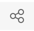
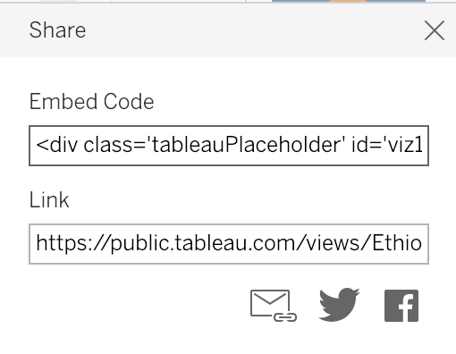
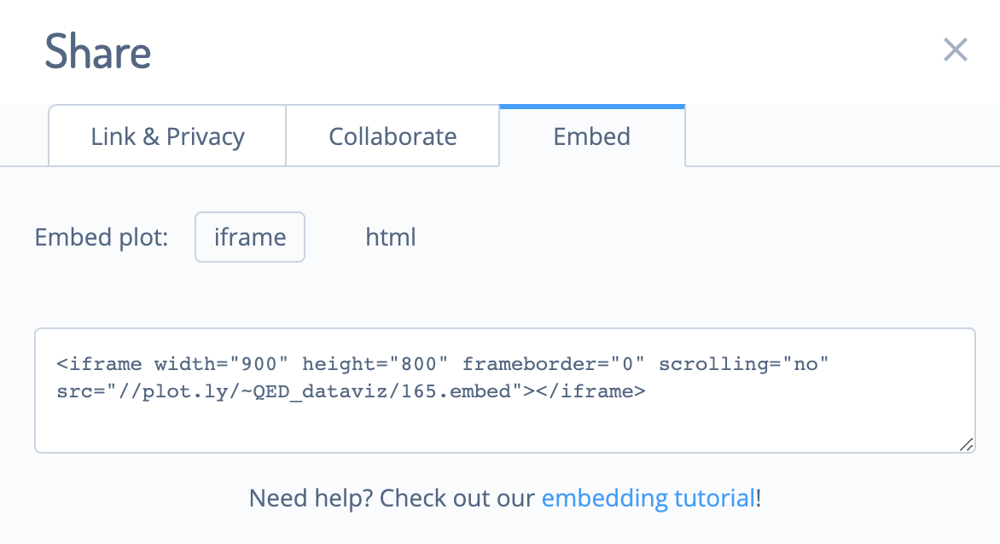
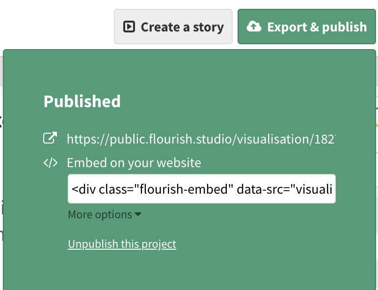
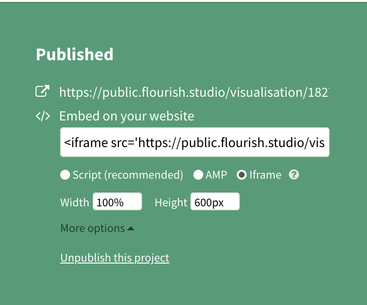

<style type="text/css">
div.container-lg.px-3.my-5.markdown-body h1 {
    display: none;
}
#header
    {font-size:27px;}

 </style> 
 

# CGDV COVID-19 Challenge Submission Guidance
Step by step instructions on uploading visuals to CGDV platform  

## Step 1 

Go to [Center for Global Data Visualization](https://www.centerforglobaldata.org/authentication/signin), create an account and complete the profile with a photo. Then start your submission through "My Visuals" button on the top right.

## Step 2
Fill out all information needed including Visualization Title, Country, University or Organization, challenge and Data Source. For team submission, you can add you team members by using "Multiple Users for this Submission" option at the bottom.

## Step 3 Upload your visual

Under Embed, you will find 3 options to upload your visual: Source, Embed url, Document

### Source
If your visualization is in any site hosting service such as GitHub Pages, select *Source* and put the URL in the box after Embed.  
  
For visualization webpage with embed code, you can also follow the instructions in Embed url section below to upload your work.  
    
### Embed url
If your visulization tool provides code for embedding your interactive data visualization, select *Embed url* and add embed code in the box after Embed.  
  
You can find some examples to locate the embed code below:   
  
#### Google Slides

If you have multiple graphs and not familiar with web development, you can create your visualization story using [Google Slides](https://www.google.com/slides/about/) and embed it on CGDV by putting following embed code into "Embed Code" section. Please replace "GOOGLE SLIDES SHARING LINK" to your own sharing link and keep quotation marks outside.

```
<iframe width="1200" height="800" frameborder="0" src="GOOGLE SLIDES SHARING LINK"> </iframe>
```

#### Visual built with visualization platform

* Tableau

Publish your visual to Tableau public. Find the share button  under your visual. 

Find the embed code. 



Copy and paste embded code into embed code box on CDGV.

* Plotly

Find the share button  in your Plotly visual. 

Find the iframe embed code. 



Copy and paste embded code into embed code box on CDGV.

* Flourish

Publish your Flourish visual. 



Under "More options", find the iframe embed code. 



Copy and paste embded code into embed code box on CDGV.

#### Customized visualization

If you created advanced visualization using tools such as D3. Please upload your visualizaton to your own Github page, and use iframe tag (e.g.(

```
<iframe width="1200" height="1500" frameborder="0" src="your visual source"> </iframe>
```

) in embed code section on CGDV.  
  
### Document  
  
If your visulization is in static format such as word, pdf or excel, select *Document* and use the Choose File button to upload files. Remember to click Upload after choosing a file. You are allowed to upload one or multiple files.  
  
## Step 4 Upload your code file  
For this challenge, we require participants to submit codes that are used for data wrangling. Codes will be assessed during an initial Quality Assurance process to prevent any data misinterpretation.  

If you upload your visual using either *Source* or *Embed url* in Step 3, upload the code file to a file storage platform such as Google Drive. Copy and paste the shareable link into the Description box below. Please make sure anyone with the link can view and download the file. But don't give access to edit.  
    
If you upload your visual using *Document* in Step 3, upload the code file along with your visualization file.    
  
## Step 5 Upload a visual cover picture  
Upload a cover picture for your visual. Your cover picture along with your visulizaton title will be presented in the CGDV Library as a submission entry.  


## Step 6 Double check your submission 

Go to "My Visuals" on CGDV, scroll down and you should see you submission. Go into your submission and make sure everything looks good. In addition, make sure your submission has a profile picture.

# Having problem to upload?

Please contact Xiner Ning(xning@qedgroupllc.com) with your issue, we will response ASAP.
